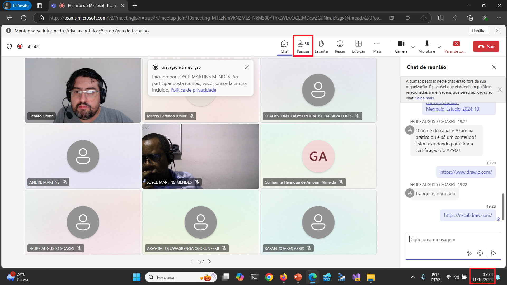
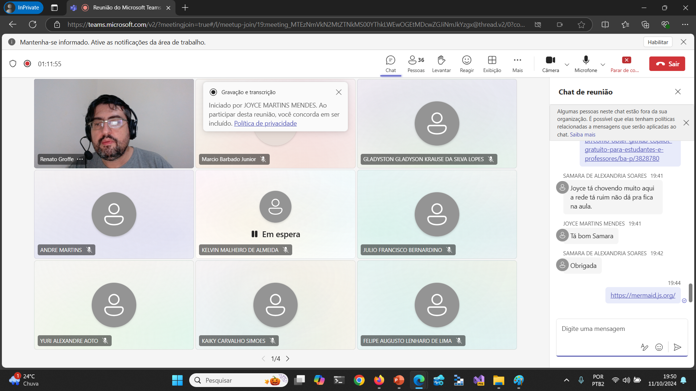
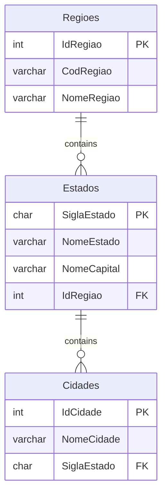
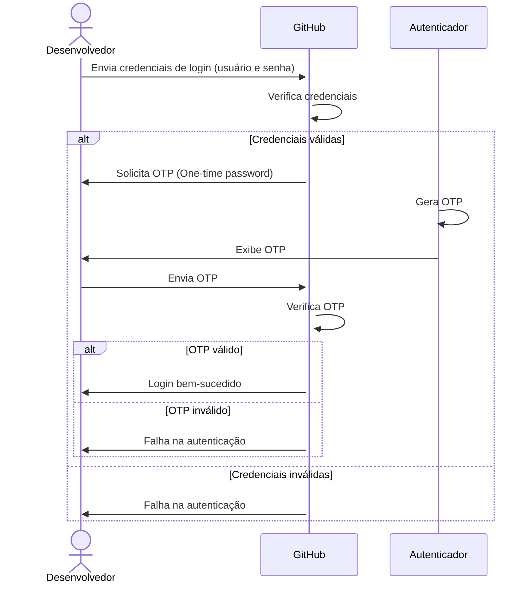

# GitHubCopilot-Mermaid_Estacio-2024-10
Conteúdos da apresentação "GitHub Copilot + Mermaid: simplificando a geração de documentações com Inteligência Artificial" realizada em 11/10/2024.

---

Título da apresentação: **GitHub Copilot + Mermaid: simplificando a geração de documentações com Inteligência Artificial**

Quando: **11/10/2024 (sexta-feira)**

Palestrante: Renato Groffe - **Microsoft MVP, MTAC**

Tipo do evento: **Online**

Ferramenta de transmissão: **Microsoft Teams**

Agradecimentos ao [**Prof. Mauricio Wieler Orellana**](https://www.linkedin.com/in/mauricio-wieler-orellana-3b578013a/) pelo convite e por todo o apoio na realização desta palestra, assim como a outros professores e alunos que estiveram presentes no evento.

Número de participantes: **55 pessoas (pico de audiência ao longo da live)**

Tecnologias e tópicos abordados: **GitHub Copilot, Mermaid, GitHub, Visual Studio Code, Git, SQL, UML, Modelagem de Sistemas, Autenticação Multifator...**

---






---

## Diagramas gerados durante a apresentação

### Diagrama de Entidade-Relacionamento

Estrutura com Regiões x Estados x Cidades:



### Diagrama de sequência

Texto informado no GitHub Copilot Chat:

```txt
Gere para mim um diagrama de sequência que explique o processo de login no GitHub, incluindo o uso de autenticação multifator (MFA). O MFA no caso utiliza OTP (One-time password) e um autenticador que gera essas chaves. O ator no diagrama se chamará Desenvolvedor.
```

Resultado:

