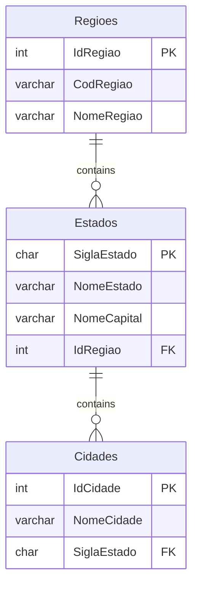

# GitHubCopilot-Mermaid_Estacio-2024-10
Conteúdos da apresentação "GitHub Copilot + Mermaid: simplificando a geração de documentações com Inteligência Artificial" realizada em 11/10/2024.

---

## Diagramas gerados durante a apresentação

### Diagrama de Entidade-Relacionamento

Estrutura com Regiões x Estados x Cidades:

