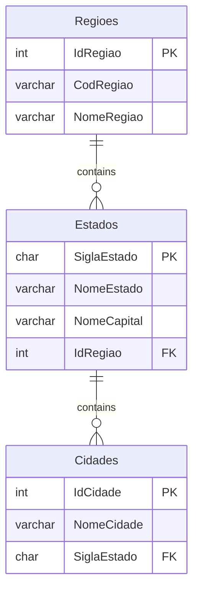
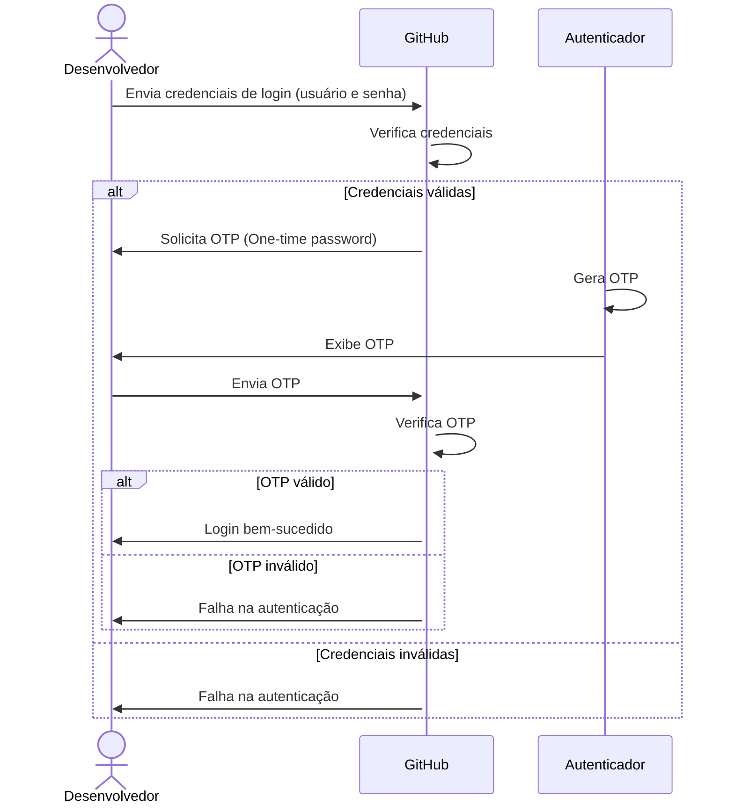

# GitHubCopilot-Mermaid_Estacio-2024-10
Conteúdos da apresentação "GitHub Copilot + Mermaid: simplificando a geração de documentações com Inteligência Artificial" realizada em 11/10/2024.

---

## Diagramas gerados durante a apresentação

### Diagrama de Entidade-Relacionamento

Estrutura com Regiões x Estados x Cidades:



### Diagrama de sequência

Texto informado no GitHub Copilot Chat:

```txt
Gere para mim um diagrama de sequência que explique o processo de login no GitHub, incluindo o uso de autenticação multifator (MFA). O MFA no caso utiliza OTP (One-time password) e um autenticador que gera essas chaves. O ator no diagrama se chamará Desenvolvedor.
```

Resultado:

